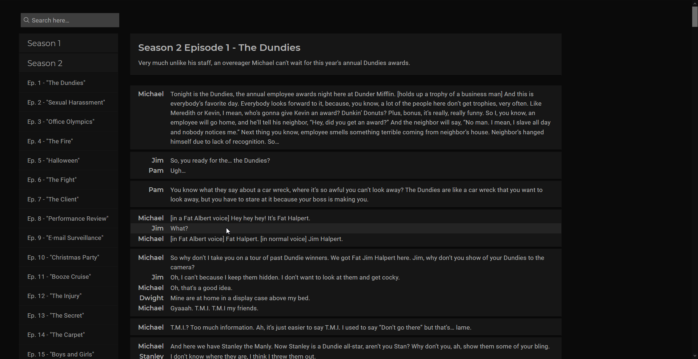

# the-office

A Vue.js and Flask Web Application designed to provide a quick way to search for quotes from NBC's "The Office".

## Screenshots

## Features

- Vue.js based, providing fast SPA functionality
    - Setup via Vue CLI
    - Vue Router
    - Vue Bootstrap
    - Axios
    - Vue Instantsearch (Algolia)
- Backend API provided by Flask
- Instant Search provided Algolia
- Sleek, responsive design that is easy on the eyes

## Setup

This project was built on Python 3.7 and Node v12.18.3 / npm 6.14.6.

- Vue.js can be ran via `npm run serve`.
    - Run this in `./client/`.
- Flask can be ran via `flask run`.
    - Run this in `./server/`.
    - Add `--host=0.0.0.0` to the end to allow connections from LAN.
    
Note: Readying this application for Production and wider-development is still in progress.

**Don't try to run this application just yet.**

## To-do

Small to-do list to complete.

- Font Awesome Icons
    - SeasonList Chevron
    - Quote Permalink
- Attempt Algolia Query Suggestions
    - Redirect to SearchResults page on Enter press
- Process all quote data
- Site Meta Tags
- Better Mobile Season List
    - Smaller, collapsible?
- Heroku Production Deployment
    - Possible solution via Docker
- Axios 'Fetch' Error Handling
- Navigation Bar
    - Navbar Logo (?)
- Overall Responsiveness Improvements
- Algolia Clickthrough Events
    - Search Results Page
- Character List
- Quote Permalink
- Deleted Scenes Marker
    - Possible 'Flashback' Scene Marker
- Season List Episode Modal Popover
    - Preview Image, Description, Episode Stats
- Quote Likes Database
    - Requires difficult implementation of Flask controlled Postgres database
    - Requires funding, longterm free hosting not possible with database requirements
